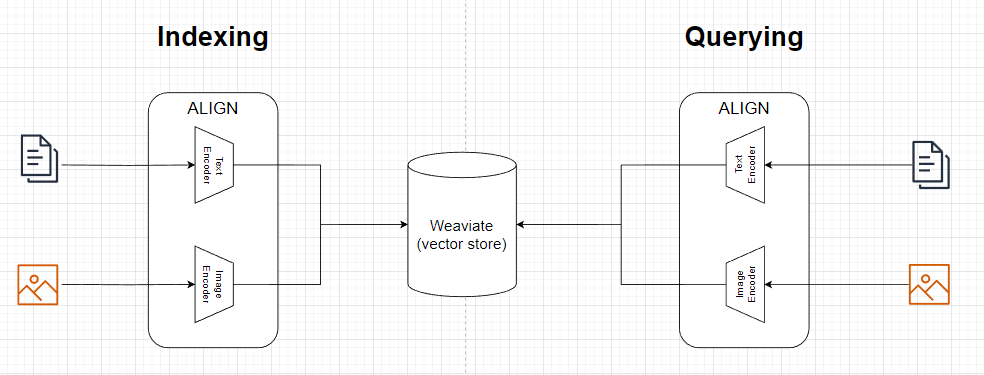
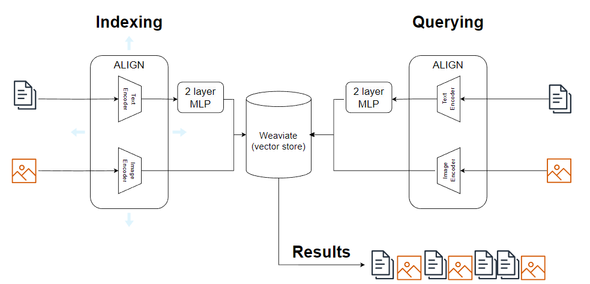
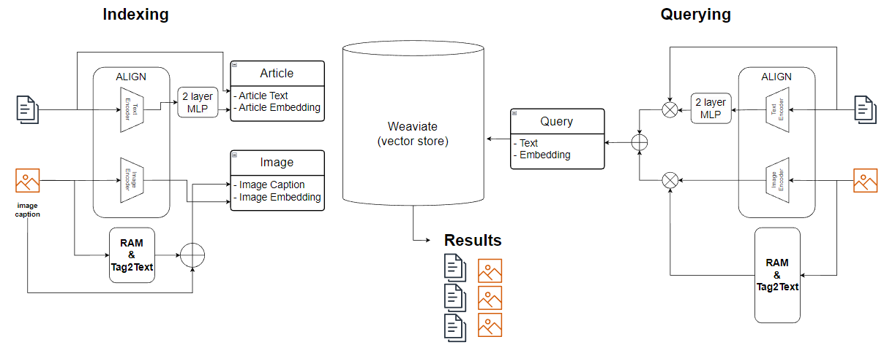
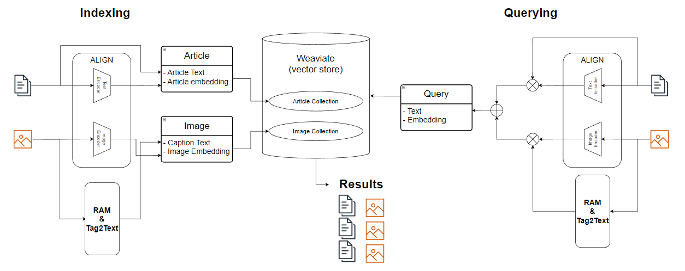

# Multi-modal IR search demo

This is a demo of some multi-modal IR search experiments. The goal of this exploration was to see if the retrieval of both articles and images stored in a single vector database using a single query is possible.

The demo is built using FastAPI, Streamlit, and Weaviate as the vector database.

Models used for this demo include:
- [ALIGN](https://blog.research.google/2021/05/align-scaling-up-visual-and-vision.html) for feature extraction, 
- [RAM and T2T](https://recognize-anything.github.io/) for caption generation
- 2 layer MLP to reduce the [heterogeniety gap](https://www.sciencedirect.com/science/article/pii/S0893608020304093#:~:text=The%20%E2%80%9Cheterogeneity%20gap%E2%80%9D%20means%20that,instances%20cannot%20be%20measured%20directly.) between text and image embeddings.

The demo uses a Weaviate vector database prepopulated with articles and images from the [M2E2](http://blender.cs.illinois.edu/software/m2e2/) dataset.

### Directory Structure

```
.
├── build/
│   ├── .env
│   └── docker-compose.yml
├── data/
│   └── m2e2/
│       ├── article
│       ├── image/
│       │   └── image
│       └── image_url_caption.json
├── diagrams/
│   └── *.png
├── fastapi/
│   ├── models/
│   │   ├── ram/
│   │   │   ├── configs/
│   │   │   │   ├── swin/
│   │   │   │   │   └── *.json
│   │   │   │   └── *.json
│   │   │   ├── data/
│   │   │   │   └── *.txt
│   │   │   ├── models/
│   │   │   │   ├── __init__.py
│   │   │   │   ├── bert.py
│   │   │   │   ├── ram.py
│   │   │   │   ├── swin_transformer.py
│   │   │   │   ├── tag2text.py
│   │   │   │   ├── utils.py
│   │   │   │   └── vit.py
│   │   │   ├── __init__.py
│   │   │   ├── inference.py
│   │   │   └── transform.py
│   │   ├── utils/
│   │   │   ├── ALIGNManager
│   │   │   └── MLPManager
│   │   ├── weights/
│   │   │   ├── mlp_weights.pth
│   │   │   ├── ram_swin_large_14m.pth
│   │   │   └── tag2text_swin_14m.pth
│   │   └── __init__.py
│   ├── Dockerfile
│   ├── main.py
│   ├── requirements.txt
│   └── WeaviateManager.py
├── streamlit/
│   ├── Dockerfile
│   ├── requirements.txt
│   └── ui.py
├── vector_db
├── .gitattributes
├── .gitignore
├── .gitmodules
└── README.md

```

# Setup

1) Download pretrained weights for both RAM and Tag2Text and store them under fastapi/models/weights.
<table>
  <thead>
    <tr style="text-align: right;">
      <th></th>
      <th>Name</th>
      <th>Backbone</th>
      <th>Data</th>
      <th>Illustration</th>
      <th>Checkpoint</th>
    </tr>
  </thead>
  <tbody>
    <tr>
      <th>1</th>
      <td>RAM-14M</td>
      <td>Swin-Large</td>
      <td>COCO, VG, SBU, CC-3M, CC-12M</td>
      <td>Provide strong image tagging ability.</td>
      <td><a href="https://huggingface.co/spaces/xinyu1205/Recognize_Anything-Tag2Text/blob/main/ram_swin_large_14m.pth">Download  link</a></td>
    </tr>
    <tr>
      <th>2</th>
      <td>Tag2Text-14M</td>
      <td>Swin-Base</td>
      <td>COCO, VG, SBU, CC-3M, CC-12M</td>
      <td>Support comprehensive captioning and tagging.</td>
      <td><a href="https://huggingface.co/spaces/xinyu1205/Recognize_Anything-Tag2Text/blob/main/tag2text_swin_14m.pth">Download  link</a></td>
    </tr>
  </tbody>
</table>

2) Download the [pretrained weights](https://drive.google.com/file/d/1kaae6F6wEkZM8YrhYx00PVXTlmCrv192/view?usp=sharing) for the MLP and store them under fastapi/models/weights.

3) Download a pre-populated Weaviate vector database from [here](https://drive.google.com/file/d/1GGdZn3qtQ7dRh0IlC-dFwX9C23756Qmz/view?usp=drive_link), unzip it and store it at the root of the project.

4) Download the M2E2 dataset from [here](http://blender.cs.illinois.edu/software/m2e2/) and store it under data/m2e2.

5) Build the docker image and start the containers.

```
$ cd build
$ docker compose build
$ docker compose up
```

6)  View the demo at http://localhost:8501. FastAPI docs can be viewed at http://localhost:8000/docs.

# Architecture

#### Model 0: Pure vector similarity with ALIGN


#### Model 1: Vector similarity with MLP


#### Model 2: Hybrid search with MLP


#### Model 3: Hybrid search with separate collections
